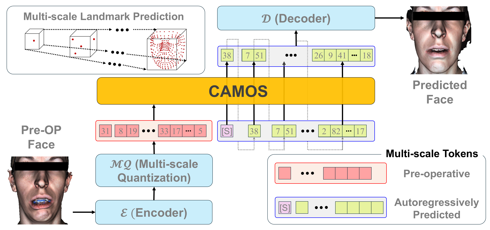
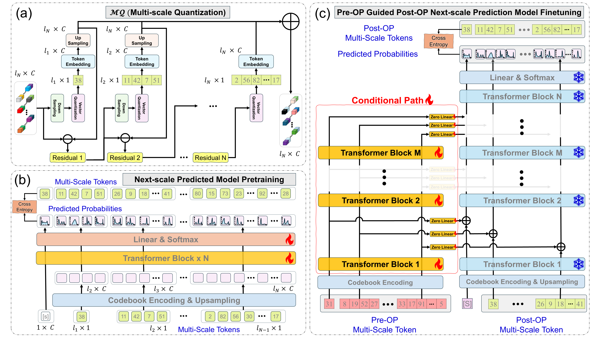

# CAMOS: Conditional Autoregressive Modeling for Orthognathic Surgery

**Facial Appearance Prediction with Conditional Multi-scale Autoregressive Modeling for Orthognathic Surgical Planning**  
Jungwook Lee, Xuanang Xu, Daeseung Kim, Tianshu Kuang, Hannah H. Deng, Xinrui Song, Yasmine Soubra, Rohan Dharia, Michael A.K. Liebschner, Jaime Gateno, Pingkun Yan  

---

## Overview
CAMOS is a deep learning framework for predicting **patient-specific optimal 3D facial appearance** from preoperative face for **orthognathic surgical planning**.  
It uses a **hierarchical coarse-to-fine multi-scale autoregressive approach**, pretrained on a large-scale dataset of 44,602 normal faces and fine-tuned on in-house patient dataset, to produce realistic and harmonized facial predictions.

---

## Key Features
- **Hierarchical Multi-scale Prediction**: Coarse-to-fine refinement for better detail and facial harmony.
- **Large-scale Pretraining**: Robust generative modeling on diverse facial demographics.
- **Conditional Generation**: Patient-specific prediction using preoperative facial landmarks.
- **3D Surface Reconstruction**: Outputs full 3D facial meshes for surgical planning.
  
---

## Method
1. **Multi-scale VQ-VAE** extracts hierarchical latent tokens from facial landmarks.  
2. **Visual Autoregressive Modeling (VAR)** predicts next-scale tokens from coarse to fine.  
3. **Conditional Fine-tuning** integrates patient preoperative data.  
4. **Thin-Plate Spline (TPS)** reconstructs the 3D surface.

  

---

## Dataset
- **Pretraining**: DAD-3DHeads, Headspace, FaceScape, BU-3DFE (total 44,602 faces).
- **Fine-tuning**: 86 orthognathic surgery patients (in-house dataset).

Due to privacy concerns, patient data is not publicly released.

---

## Results
- **Chamfer Distance**: 1.91 mm (lips), 2.37 mm (chin) – best among compared methods.
- Generates **realistic, patient-specific** postoperative predictions with fine details and correct alignment.

---

## Citation

---

## License
This project is licensed under the [MIT License](LICENSE).
